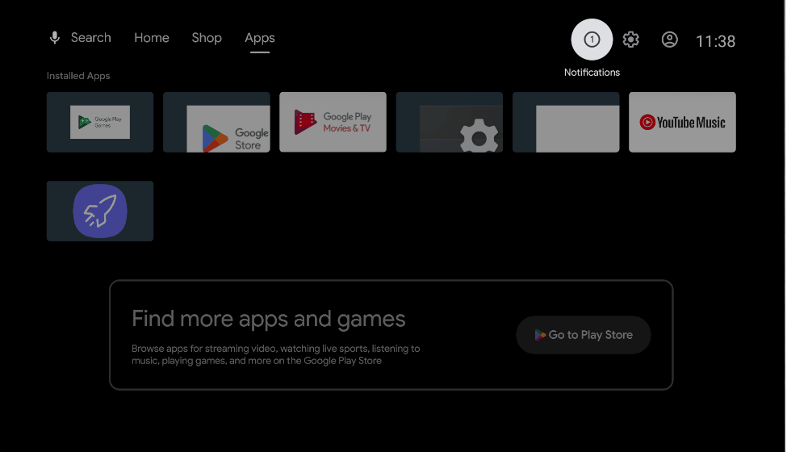

# App Launcher

A simple Android app launcher that automatically launches your chosen app when the device starts. Perfect for setting up dedicated TV devices that boot directly into your preferred app.

**Author:** Moe Jayyusi  
**License:** Open Source - Free to use, modify, and distribute

## What it does

- Shows all your installed apps in a grid
- Lets you pick one app to launch automatically when the device starts
- Works with TV remote controls and keyboards
- Has a countdown timer before launching the selected app
- **Main purpose**: Turn any Android TV/Fire TV into a dedicated app launcher

## Demo

  
   
  <em>App Launcher in action - Browse apps, select one, and watch it launch automatically!</em>

## How to use

1. **Open the app** - Launch App Launcher from your device
2. **Browse apps** - Use arrow keys or touch to navigate the grid
3. **Select an app** - Press Enter/OK on your chosen app
4. **Confirm** - Review your selection and press "Launch Now"
5. **Countdown** - Wait for the timer or press any key to cancel

## Controls

- **Arrow keys**: Navigate through apps
- **Enter/OK**: Select apps and buttons
- **Back/Escape**: Go back or exit
- **Any key**: Cancel the countdown timer

## Installation

### Direct Download
**Latest APK**: [Download here](https://github.com/MJayyusi/applauncher/releases/latest/download/applauncher.apk)

### Recommended Apps
For the best experience, we recommend installing **Tawkit** - a prayer times application for mosques:

- **Android 5 to 13**: [Download Tawkit APK](https://offline.tawkit.net/admin/tawkit-9.61-android.apk) | Downloader by AFTVnews code: **5401845**
- **Android 14+ and recent devices**: [Download Tawkit APK (x64)](https://offline.tawkit.net/admin/tawkit-9.61-android-x64.apk) | Downloader by AFTVnews code: **3028470**

Tawkit displays accurate prayer times and schedules, making it perfect for TV displays in mosques and Islamic centers when paired with App Launcher.

### Using AFTVnews Downloader (TVs)
1. Open AFTVnews Downloader app on your Fire TV
2. Enter code: **1806704**
3. Or visit: http://aftv.news/1806704
4. The app will download and install automatically

### For Phones and Tablets

1. Download the APK file
2. Enable "Unknown Sources" in Android settings
3. Install the APK
4. **Set as Home Launcher** (Optional):
   - Go to Settings > Apps > Default Apps > Home App
   - Select "App Launcher" as your default home app
   - Press Home button to test

### For Android TV / Google TV

**Purpose**: Set App Launcher as your default launcher so it automatically starts your chosen app when the TV boots.

1. Download the APK file
2. Enable "Unknown Sources" in Android TV settings
3. Install the APK
4. **Enable Accessibility Service** (Required for launcher functionality):
   - Go to Settings > Accessibility
   - Find "App Launcher" in the list
   - Turn ON the accessibility service
   - Grant all required permissions
5. **Configure Auto-Launch**:
   - Open App Launcher
   - Select your desired app from the grid
   - The app will now launch automatically when TV starts

### For Amazon Fire TV

**Purpose**: Set App Launcher as your default launcher so it automatically starts your chosen app when the Fire TV boots.

1. Download the APK file
2. Enable "Apps from Unknown Sources" in Fire TV settings:
   - Go to Settings > My Fire TV > Developer Options
   - Turn ON "Apps from Unknown Sources"
3. Install the APK using ADB or sideloading method
4. **Enable Accessibility Service** (Required for launcher functionality):
   - Go to Settings > Accessibility
   - Find "App Launcher" in the list
   - Turn ON the accessibility service
   - Grant all required permissions
5. **Configure Auto-Launch**:
   - Open App Launcher
   - Select your desired app from the grid
   - The app will now launch automatically when Fire TV starts

---

**Open Source Project** - Free to use, modify, and distribute.